  # **F1 Driver and Constructor Performance Project**

>[!NOTE]
>This project is based on the course [Azure Databricks & Spark for Data Engineers:Hands-on Project](https://www.udemy.com/course/azure-databricks-spark-core-for-data-engineers/) by **Ramesh Retnasamy**. All course materials were prepared by **Ramesh Retnasamy**. This repository represents my personal implementation and learning progress from the course. Although course materials are permitted to be used for GitHub and resume purposes, I have only included the files and scripts that I personally created through the course.


## Table of Contents

- [0. What I Learnt](#0-what-i-learnt)
  - [Microsoft Azure](#microsoft-azure)
  - [Databricks & Data Engineering](#databricks--data-engineering)
- [1. Setup ](1-setup)
  - [Storage Credential, External Location, Access Connector and Unity Catalog](#storage-credential-external-location-access-connector-and-unity-catalog)
  - [Infrastructure & Security Setup](#infrastructure--security-setup)
- [2. Medallion Architecture and ETL Pipelines](#2-medallion-architecture-and-etl-pipelines)
  - [Landing Layer (Raw Files)](#landing-layerraw-files)
  - [Bronze Layer](#bronze-layer)
  - [Silver Layer](#silver-layer)
  - [Gold Layer](#gold-layer)
- [3. Dashboard](#3-dashboard)
  - [Driver Standings](#driver-standings)
  - [Constructor Standings](#constructor-standings)
  - [Dominant Drivers](#dominant-drivers)
  - [Dominant Constructors](#dominant-constructors)
- [4. Databricks Job](#databricks-job)

## 0. What I Learnt

### Microsoft Azure
- [x] Azure Databricks Workspace
- [x] Storage Account (*Creating ADLS Gen2 containers & management*)
- [x] Access Connector for Databricks

In summary, I learned how to provision, configure, and manage core Azure cloud resources.
  
### Databricks & Data Engineering
- [x] **Unity Catalog & Security:** Creating Storage Credentials and External Locations for ADLS Gen2
- [x] **Data Pipeline:** Building ETL Pipelines & Implementing **Medallion Architecture** (Bronze, Silver, Gold)
- [x] **Compute & Orchestration:** Configuring Clusters & Databricks Jobs
- [x] **Visualization:** Designing Databricks Dashboards


>[!NOTE]
>This course explains incremental data processing but I haven't done it in this project. I applied it [this project](https://github.com/BarunAga/Order-Data-Normalization-Project) to understand whole incremental data processing works.
## 1. Setup
### Storage Credential, External Location, Access Connector and Unity Catalog
`Unity Catalog` is a security framework that manages who can access data within a metastore.
  - `Storage Credential` provides secure, passwordless access to cloud storage.
  - `External Location` links cloud storage to Unity Catalog using a Storage Credential.
  - `Access Connector` binds Azure Managed Identity permissions to Unity Catalog Storage Credentials..

### Infrastructure & Security Setup

1. **Azure Resource Provisioning:** Created a  Resource Group containing an `Azure Databricks Workspace` and an `Azure Data Lake Storage Gen2 (ADLS Gen2)` account.
2. **Access Connector Configuration:** Provisioned an `Access Connector for Azure Databricks` (Managed Identity) and assigned it the `Storage Blob Data Contributor` role on the Storage Account.
3. **Storage Credential:** Manually created a `Storage Credential` in Unity Catalog using the Access Connector's Resource ID.
4. **External Location:** Executed SQL scripts to create an `External Location`, linking the Storage Credential to the target ADLS Gen2 container path.
   ```sql
    CREATE EXTERNAL LOCATION IF NOT EXISTS your_external_location_name_on_azure
    URL 'your_external_location_url'
    WITH (STORAGE CREDENTIAL `your_storage_credential_name`)
    COMMENT 'External location for the formula1 container';
   ```
## 2. Medallion Architecture and ETL Pipelines

## There are 4 layers in this project:

### Landing Layer(Raw Files):
Contains raw data in Cloud Storage.

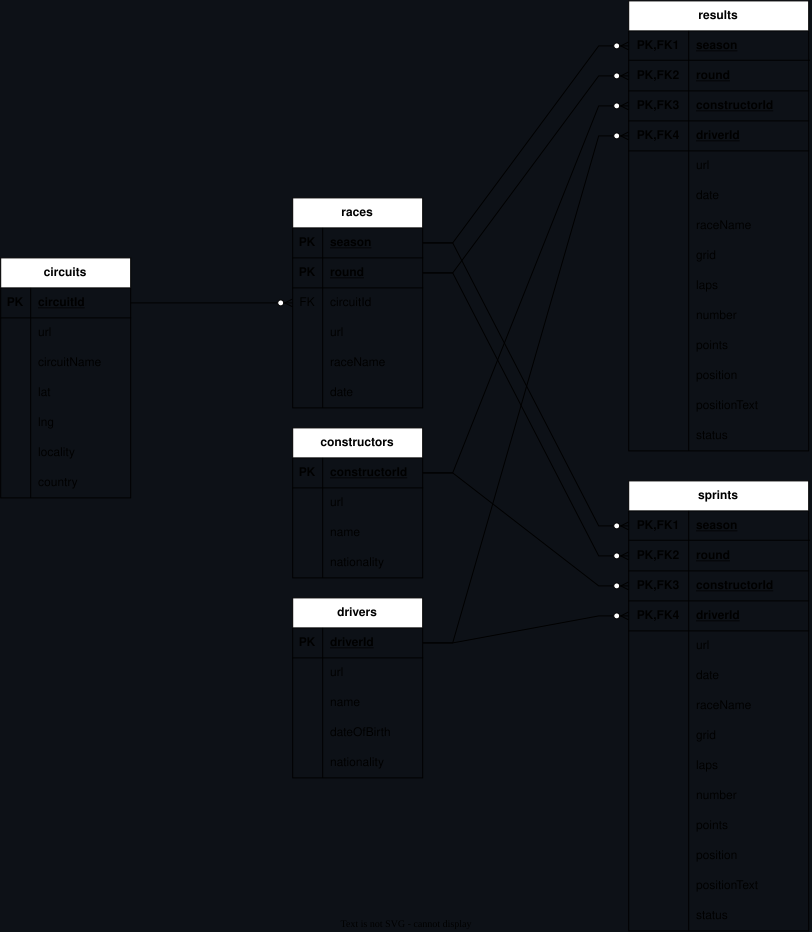

### Bronze Layer:
Ingested raw data into **Delta tables**, appending `source_file` and `ingested_timestamp` metadata columns.

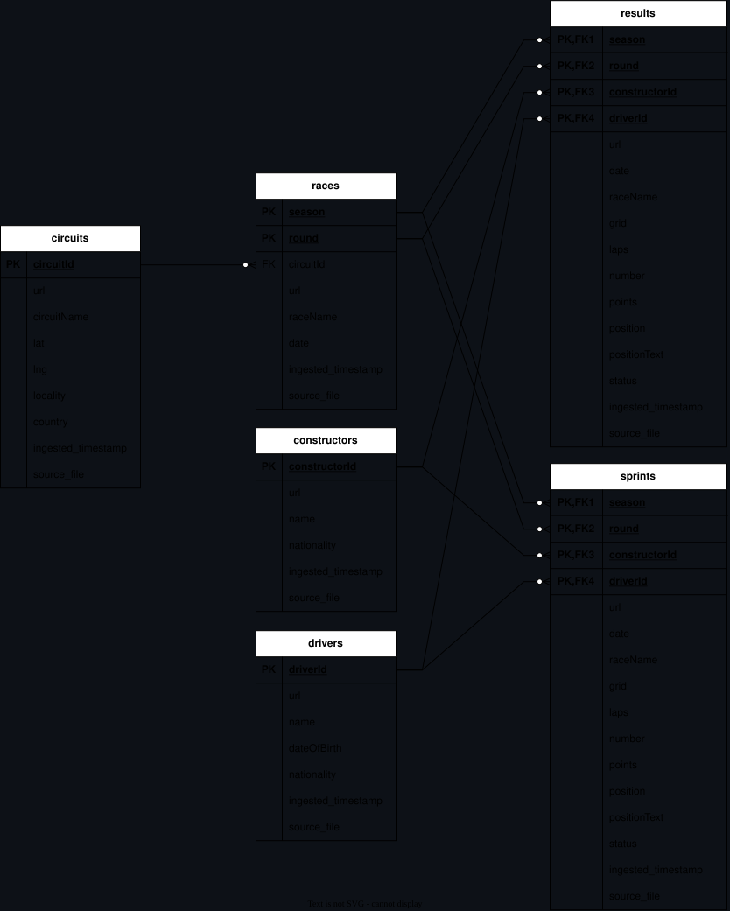

### Silver Layer:
Dropped `url` column from each bronze table and applied transformations and filters.

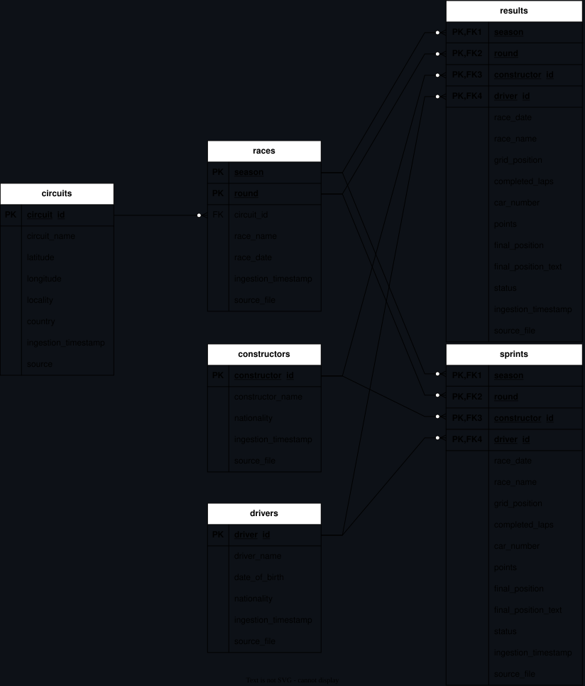


### Gold Layer:
Created `dim_constructors` `dim_races` `dim_drivers` `fact_results` tables in a star schema design.

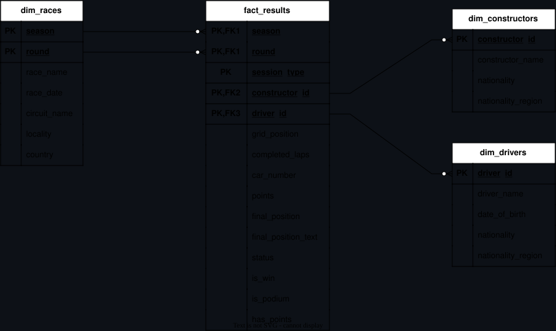


>[!NOTE]
>You can examine [bronze](02-bronze/),  [silver](03-silver/) and [gold](04-gold/) scripts for more.

## 3. Dashboard

When gold layer is done, a dashboard created to visualize `Driver Standings`, `Constructor Standings`, `Dominant Drivers` and `Dominant Constructors`.

### [Driver Standings](05-analytics/01.Build_Driver_Standings(SQL).sql)
`Driver standings` are calculated based on total points earned in a season. If two drivers are tied on points, the driver with the most race wins takes the higher position.

```sql
DENSE_RANK() OVER (PARTITION BY season ORDER BY SUM(points) DESC, SUM(CASE WHEN finish_position = 1 THEN 1 ELSE 0 END) DESC) AS standing_position
```
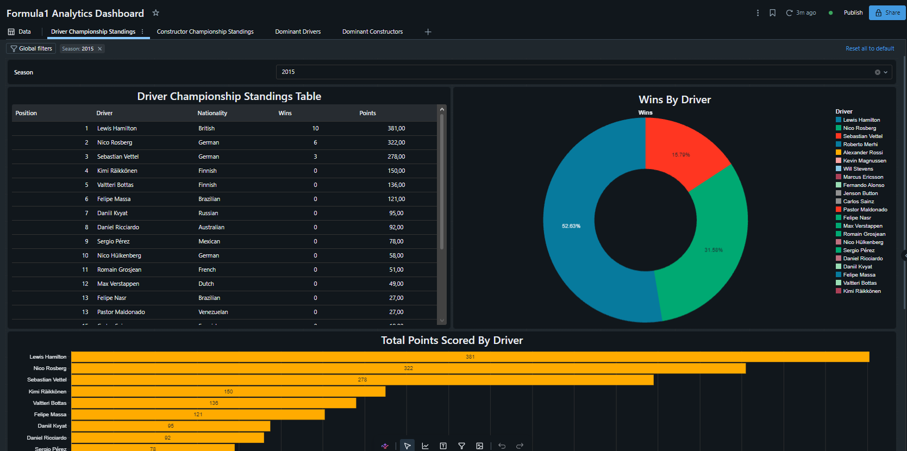

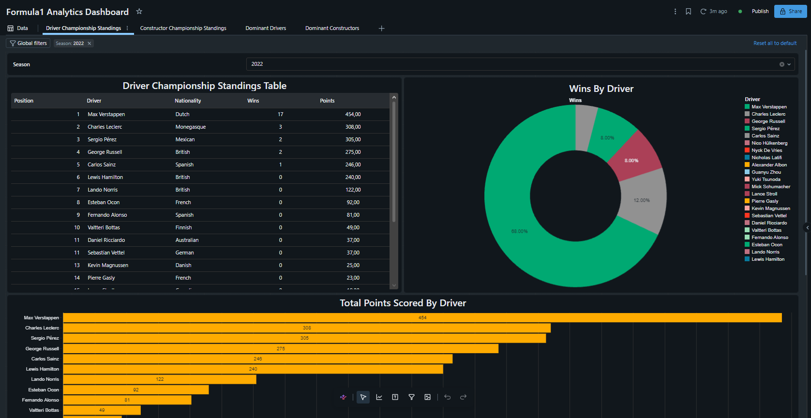


### [Constructor Standings](05-analytics/02.Build_Constructor_Standings(SQL).sql)
The `Constructor Standings` logic mirrors `Driver Standings`. However, this query evaluates race wins using `COUNT_IF(r.is_win)` instead of the `CASE WHEN finish_position = 1` conditional logic, yielding the exact same result with cleaner syntax.

```sql
RANK() OVER (PARTITION BY r.season ORDER BY SUM(r.points) DESC, COUNT_IF(r.is_win) DESC) AS standing_position
```


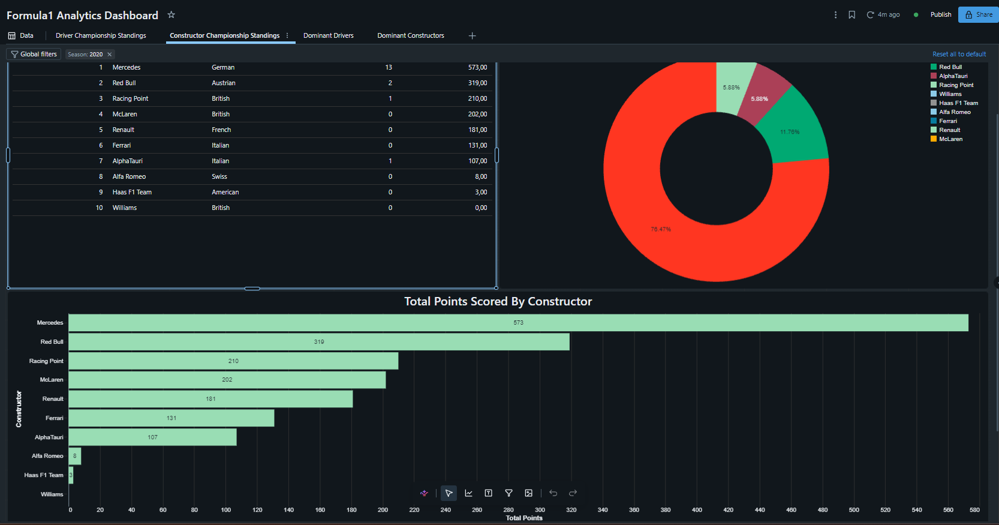


### [Dominant Drivers](05-analytics/12.Formula1_Dominant_Drivers.dbquery.ipynb)
For `Dominant Drivers`, `Total Championships` and a custom `Greatness Score` were calculated for each driver. The `Greatness Score` is a custom-defined metric rather than an official F1 statistic. This formula was introduced to normalize cross-era statistics, balancing historical drivers' lower race counts and older scoring systems against modern drivers' longer seasons and higher point yields. 

```sql
SUM(CASE WHEN standing_position = 1 THEN 1 ELSE 0 END) AS total_championships
(100*total_championships + 7*total_wins + 3*total_podiums) AS greatness_score
```
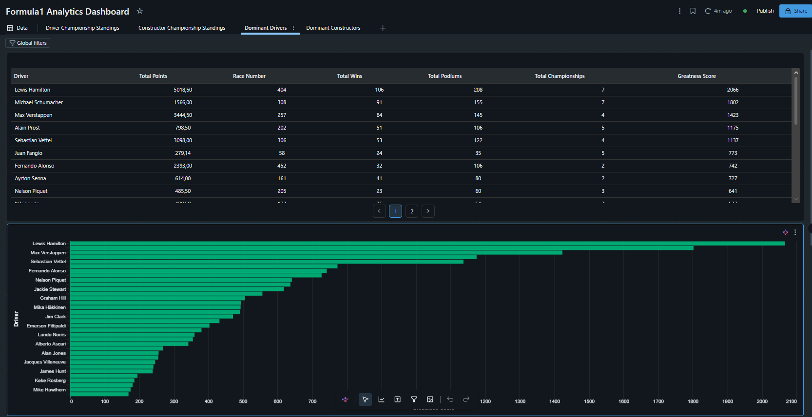

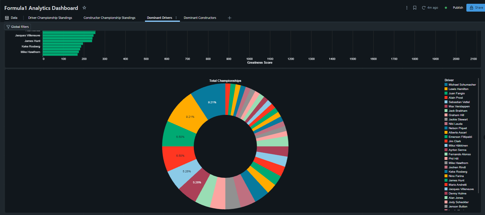


### [Dominant Constructors](05-analytics/13.Formula1_Dominant_Constructors.dbquery.ipynb)
This is same with `Dominant Drivers` but for `Constructors`.

```sql
SUM(CASE WHEN standing_position = 1 THEN 1 ELSE 0 END) AS total_championships
(100*total_championships + 7*total_wins + 3*total_podiums) AS greatness_score
```
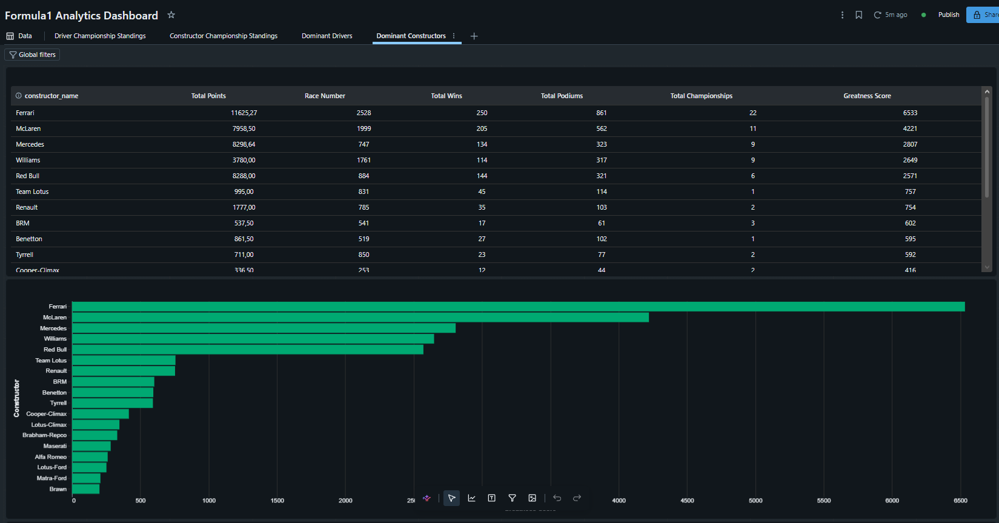

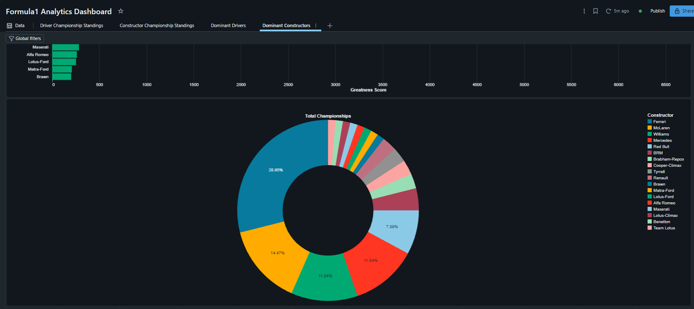

## Databricks Job
At related [course](https://www.udemy.com/course/azure-databricks-spark-core-for-data-engineers/?couponCode=26BBPAA2MX) incremental data processing is explained and implemented as job. But I didn't focus it at this project. [My second Azure Databricks project](https://github.com/BarunAga/Order-Data-Normalization-Project) focused on incremental data processing so I explained it at that project.

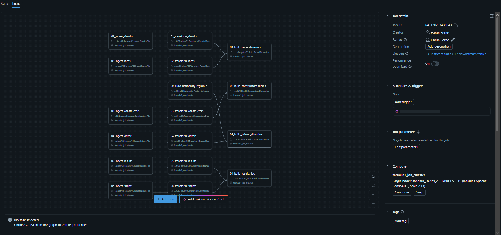
